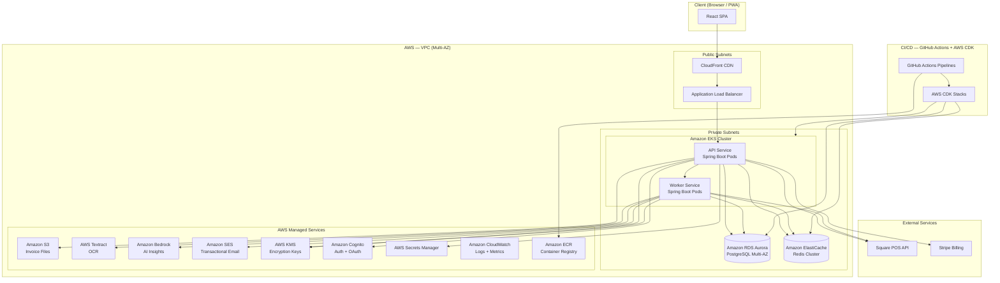
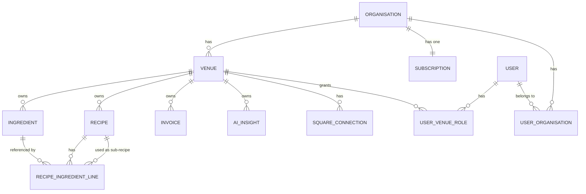
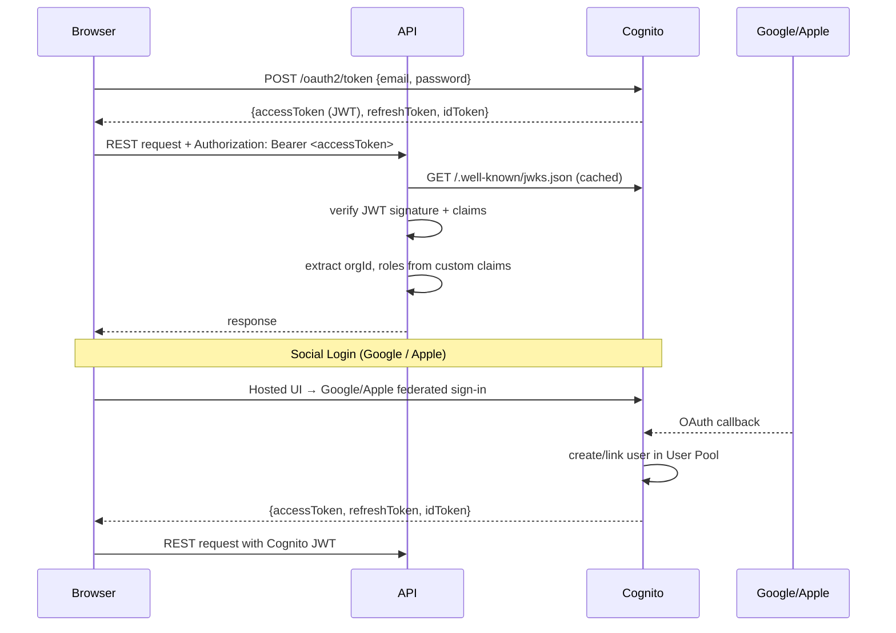
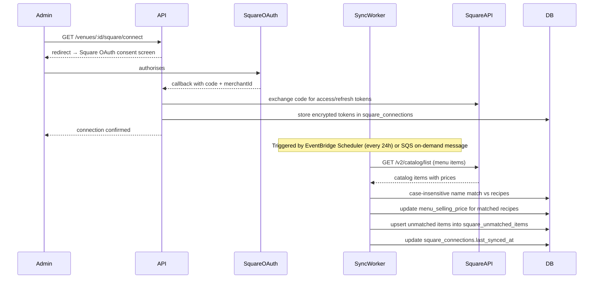
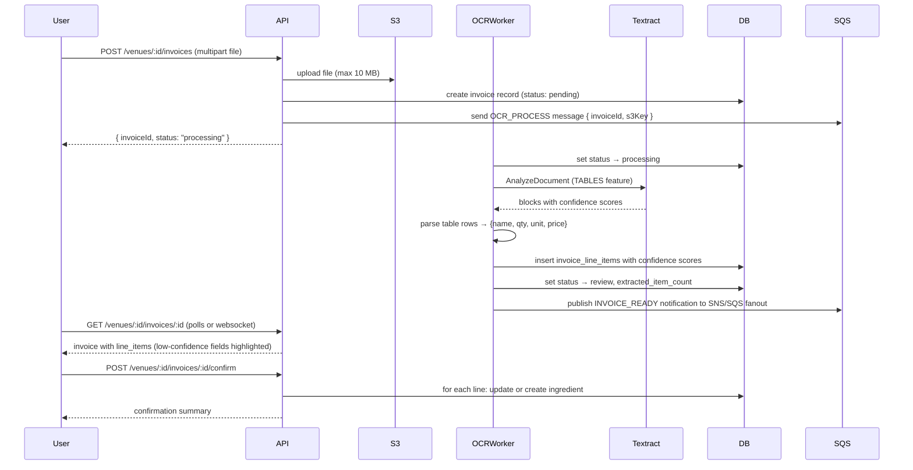
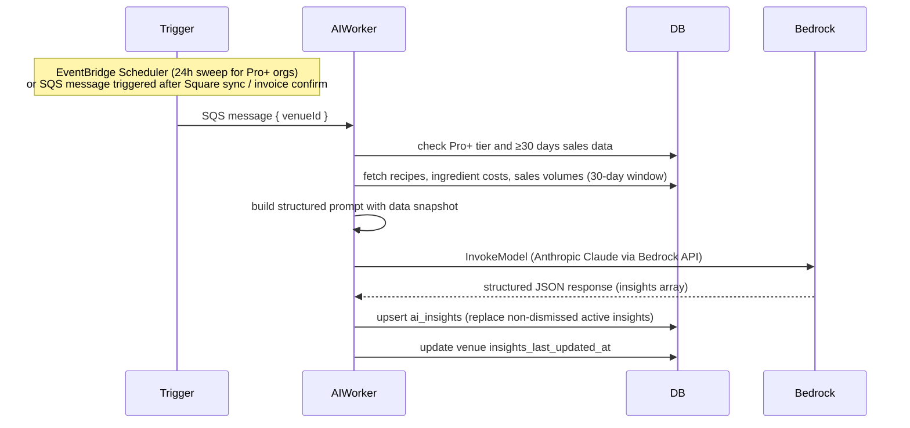
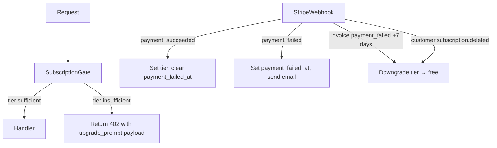

# Design Document: Food Cost Calculator

## Overview

The Food Cost Calculator is a multi-tenant SaaS application for cafes and restaurants. It enables owners and kitchen managers to manage ingredient costs, compose recipes, calculate food cost percentages, and analyse profitability across multiple venues. The system is organised around Organisations (accounts) that own Venues, with role-based access for Admin, Manager, and Staff users.

Three subscription tiers gate feature access: Free (manual entry, 2 venues, 25 recipes/venue), Pro (Square POS integration and invoice OCR upload), and Pro+ (AI-driven profitability and supplier insights).

### Key Design Goals

- **Multi-tenancy with strict data isolation** — all data is scoped to Venue, and Venue to Organisation
- **Real-time cost propagation** — ingredient price changes cascade to all dependent recipes within 2 seconds
- **Correctness of financial calculations** — rounding rules, UOM conversions, and yield adjustments are applied deterministically
- **Round-trip data fidelity** — JSON export/import must exactly restore all fields
- **Extensible pipeline architecture** — OCR and AI insights are independent async pipelines that do not block the core CRUD flow

---

## Architecture

### High-Level System Diagram



### Technology Stack

| Layer | Technology | Rationale |
|---|---|---|
| Frontend | React (TypeScript) + Vite | Fast iteration, strong ecosystem, component-based UI suits complex forms |
| State management | Zustand + React Query | Zustand for local UI state; React Query for server-state caching and real-time invalidation |
| CDN | Amazon CloudFront | Global edge caching for static assets; WAF integration for DDoS protection |
| Load Balancer | AWS Application Load Balancer (ALB) | Layer-7 routing, SSL termination, health checks, cross-AZ traffic distribution |
| API | Java 21 + Spring Boot 3 | Enterprise-grade, strong typing, mature ecosystem for financial applications; virtual threads (Project Loom) for high throughput |
| API Build | Gradle (multi-module) | Efficient incremental builds; module separation for api, workers, shared |
| Container Orchestration | Amazon EKS (Kubernetes) | Production-grade autoscaling, self-healing, rolling deployments; Cluster Autoscaler + HPA |
| Container Registry | Amazon ECR | Integrated with EKS; image scanning for vulnerabilities |
| Async Workers | Spring Batch + Spring Scheduler (same Spring Boot service, separate Deployment) | Cost propagation, Square sync, OCR processing, AI insights as separate worker pods |
| Message Queue | Amazon SQS (FIFO queues) | Managed, durable, at-least-once delivery for async jobs; replaces BullMQ/Redis queues |
| Database | Amazon Aurora PostgreSQL (Multi-AZ, Serverless v2) | Auto-scaling read replicas; ACID transactions for financial data; automatic failover |
| Cache | Amazon ElastiCache for Redis (cluster mode) | Session token store; pub/sub for cost propagation events; query cache |
| File Storage | Amazon S3 | Scalable, durable blob storage for invoice files; lifecycle policies for cost management |
| Authentication | Amazon Cognito | Managed user pools; built-in Google/Apple OAuth federation; JWT issuance; token refresh |
| OCR | AWS Textract | Structured table and form extraction; native AWS integration |
| AI | Amazon Bedrock (Anthropic Claude) | AWS-native; data residency in-region; no data sent to third-party AI providers |
| Billing | Stripe | Industry-standard subscription management; webhooks for payment lifecycle events |
| Email | Amazon SES | High-volume transactional email; deliverability reputation management |
| Secrets | AWS Secrets Manager | Rotation-enabled storage for DB credentials, API keys, encryption keys |
| Encryption | AWS KMS | CMK-based envelope encryption for Square OAuth tokens; at-rest encryption for RDS and S3 |
| Observability | Amazon CloudWatch (Logs, Metrics, Alarms) + AWS X-Ray | Distributed tracing, structured JSON log aggregation, alerting |
| Infrastructure as Code | AWS CDK (TypeScript) | Type-safe, reusable CDK constructs for all AWS resources |
| CI/CD | GitHub Actions | Build, test, Docker image push to ECR, CDK deploy |
| Service Mesh | AWS App Mesh (optional) | mTLS between services; traffic shaping for canary deployments |

### Availability and Scalability Design

#### Multi-AZ Deployment

All stateful services are deployed across at least two Availability Zones:
- **Aurora PostgreSQL**: Multi-AZ with automatic failover to standby replica (< 30 seconds RTO)
- **ElastiCache Redis**: Cluster mode with Multi-AZ replication groups
- **EKS Worker Nodes**: Node groups spread across 3 AZs using pod anti-affinity rules
- **ALB**: Natively multi-AZ; routes only to healthy pods

#### Horizontal Pod Autoscaling (HPA)

```yaml
# API Service HPA
apiVersion: autoscaling/v2
kind: HorizontalPodAutoscaler
spec:
  minReplicas: 2     # Always at least 2 pods (HA baseline)
  maxReplicas: 20    # Scales to 20 under load
  metrics:
    - type: Resource
      resource:
        name: cpu
        target:
          averageUtilization: 60
    - type: Resource
      resource:
        name: memory
        target:
          averageUtilization: 70
```

Worker pods scale independently based on SQS queue depth (KEDA or custom metrics adapter).

#### Aurora Read Replicas

Read-heavy operations (recipe costing report, search, cross-venue summary) route to Aurora read replicas via Spring Boot's `@Transactional(readOnly=true)` routing to a separate DataSource pointed at the reader endpoint.

#### CDN and Static Asset Strategy

React SPA and static assets are served from CloudFront with long-lived cache headers. API calls bypass CloudFront and go directly to the ALB. CloudFront functions handle cache-busting via content-hash filenames.

#### Circuit Breaker Pattern

Spring Boot services use Resilience4j circuit breakers on all external calls (Square API, Stripe, Textract, Bedrock, SES). Fallback strategies:
- Square sync failure → log error, retry via SQS dead-letter queue, alert
- Textract failure → retry 3× with exponential backoff, mark invoice as `failed`
- Bedrock failure → insights marked `stale`, retry on next scheduled sweep
- Stripe failure → queue webhook for retry, do not change subscription state

---

## Components and Interfaces

### Frontend Components

```
src/
  features/
    ingredients/         # Ingredient library CRUD, search
    recipes/             # Recipe builder, sub-recipe picker, cost breakdown
    reports/             # Recipe costing report, sort/filter/CSV export
    venues/              # Venue selector, cross-venue summary
    insights/            # AI insights dashboard (Pro+)
    invoices/            # Invoice upload and review (Pro)
    square/              # Square POS connection and sync (Pro)
    auth/                # Login, register, social login, password reset
    account/             # Subscription management, user management
  shared/
    components/          # CostBadge, ThresholdIndicator, UomSelect, etc.
    hooks/               # useCostPropagation, useSubscriptionGate, etc.
    utils/               # uomConversion, rounding, csvExport
```

### Backend Project Structure (Gradle Multi-Module)

```
food-cost-calculator/
  build.gradle
  settings.gradle
  modules/
    api/                          # Spring Boot API application
      src/main/java/
        config/                   # SecurityConfig, CorsConfig, JacksonConfig
        controller/               # REST controllers (one per domain)
          AuthController
          OrganisationController
          VenueController
          IngredientController
          RecipeController
          ReportController
          SquareController
          InvoiceController
          InsightController
          SubscriptionController
          WebhookController
        service/                  # Business logic
          CostingService          # Cost calculation engine
          CostPropagationService  # Triggers SQS propagation job
          IngredientService
          RecipeService
          ReportService
          SquareService
          InvoiceService
          InsightService
          SubscriptionService
        domain/                   # JPA entities
        repository/               # Spring Data JPA repositories
        dto/                      # Request/Response DTOs
        exception/                # GlobalExceptionHandler, domain exceptions
        security/                 # JwtFilter, CognitoTokenVerifier, RbacEvaluator
        filter/                   # SubscriptionGateFilter, VenueScopeFilter

    workers/                      # Spring Boot Worker application (separate Deployment)
      src/main/java/
        worker/
          CostPropagationWorker   # SQS listener: recalculates recipe costs
          SquareSyncWorker        # Scheduled + SQS: polls Square API
          OcrProcessingWorker     # SQS listener: calls Textract, parses result
          AiInsightsWorker        # Scheduled + SQS: calls Bedrock, stores insights

    shared/                       # Shared library (domain models, utilities)
      src/main/java/
        model/                    # Shared domain DTOs
        util/
          UomConverter            # UOM conversion logic + validation
          CostCalculator          # Pure calculation functions (testable in isolation)
          RoundingUtils           # Deterministic BigDecimal rounding
        constants/                # UOM enums, tier names, error codes

  infra/                          # AWS CDK (TypeScript)
    bin/
      app.ts                      # CDK app entry point
    lib/
      stacks/
        NetworkStack              # VPC, subnets, security groups, NAT gateways
        EksStack                  # EKS cluster, node groups, IRSA roles
        DatabaseStack             # Aurora PostgreSQL cluster, parameter groups
        CacheStack                # ElastiCache Redis cluster
        StorageStack              # S3 buckets (invoices, assets), lifecycle policies
        AuthStack                 # Cognito User Pool, Identity Providers (Google, Apple)
        MessagingStack            # SQS FIFO queues (cost-propagation, ocr, ai-insights, square-sync)
        ObservabilityStack        # CloudWatch dashboards, alarms, X-Ray, log groups
        CdnStack                  # CloudFront distribution, ALB origin, WAF
        SecretsStack              # Secrets Manager secrets, KMS CMKs
      constructs/
        SpringBootService         # Reusable CDK construct: EKS Deployment + Service + HPA + IRSA
```

### AWS CDK Infrastructure as Code

All AWS resources are defined in typed CDK stacks. No manual console configuration.

```typescript
// Example: SpringBootService reusable construct
export class SpringBootService extends Construct {
  constructor(scope: Construct, id: string, props: SpringBootServiceProps) {
    // EKS Deployment with configMap, health probes, resource limits
    // HPA (min 2, max 20 pods, CPU 60% target)
    // Kubernetes Service + ALB Ingress annotations
    // IRSA (IAM Roles for Service Accounts) — least-privilege IAM role per service
    // PodDisruptionBudget (minAvailable: 1) for zero-downtime rolling updates
  }
}
```

**CDK deployment pipeline (GitHub Actions):**
```
push to main → unit tests → docker build → ECR push → cdk diff → cdk deploy (staging) → integration tests → cdk deploy (prod)
```

---

## Data Models

All tables include `created_at` and `updated_at` timestamps. UUIDs are used for all primary keys.

### Entity Relationship Diagram



### Core Tables

#### `organisations`
| Column | Type | Notes |
|---|---|---|
| id | uuid PK | |
| name | varchar(100) | NOT NULL |
| created_at | timestamptz | |
| updated_at | timestamptz | |

#### `subscriptions`
| Column | Type | Notes |
|---|---|---|
| id | uuid PK | |
| organisation_id | uuid FK → organisations | UNIQUE |
| tier | enum('free','pro','pro_plus') | NOT NULL, default 'free' |
| stripe_customer_id | varchar | nullable |
| stripe_subscription_id | varchar | nullable |
| current_period_end | timestamptz | nullable |
| pending_downgrade_tier | enum | nullable — scheduled downgrade |
| payment_failed_at | timestamptz | nullable |
| created_at | timestamptz | |
| updated_at | timestamptz | |

#### `venues`
| Column | Type | Notes |
|---|---|---|
| id | uuid PK | |
| organisation_id | uuid FK → organisations | NOT NULL |
| name | varchar(100) | NOT NULL |
| address | text | nullable |
| deleted_at | timestamptz | soft-delete for deletion flow |
| created_at | timestamptz | |
| updated_at | timestamptz | |

#### `users`
| Column | Type | Notes |
|---|---|---|
| id | uuid PK | (matches Supabase Auth user id) |
| email | varchar UNIQUE | NOT NULL |
| display_name | varchar(100) | |
| created_at | timestamptz | |
| updated_at | timestamptz | |

#### `user_organisation_roles`
| Column | Type | Notes |
|---|---|---|
| id | uuid PK | |
| user_id | uuid FK → users | |
| organisation_id | uuid FK → organisations | |
| is_admin | boolean | Organisation-level admin flag |
| UNIQUE(user_id, organisation_id) | | |

#### `user_venue_roles`
| Column | Type | Notes |
|---|---|---|
| id | uuid PK | |
| user_id | uuid FK → users | |
| venue_id | uuid FK → venues | |
| role | enum('admin','manager','staff') | NOT NULL |
| UNIQUE(user_id, venue_id) | | |

#### `ingredients`
| Column | Type | Notes |
|---|---|---|
| id | uuid PK | |
| venue_id | uuid FK → venues | NOT NULL |
| name | varchar(100) | NOT NULL |
| purchase_price | numeric(10,2) | NOT NULL, > 0 |
| purchase_quantity | numeric(10,4) | NOT NULL, > 0 |
| unit_of_measure | enum(uom_list) | e.g. 'g','kg','ml','L','each' |
| yield_percentage | numeric(5,2) | default 100.00, range [1,100] |
| cost_per_unit | numeric(10,4) | computed: purchase_price / purchase_quantity |
| effective_cost_per_usable_unit | numeric(10,4) | computed: cost_per_unit / (yield_percentage / 100) |
| UNIQUE(venue_id, name) | | case-insensitive enforced in app |
| created_at | timestamptz | |
| updated_at | timestamptz | |

#### `recipes`
| Column | Type | Notes |
|---|---|---|
| id | uuid PK | |
| venue_id | uuid FK → venues | NOT NULL |
| name | varchar(100) | NOT NULL |
| portion_count | int | NOT NULL, range [1, 9999] |
| menu_selling_price | numeric(10,2) | nullable, > 0 if set |
| total_batch_cost | numeric(10,2) | computed from ingredient lines |
| food_cost_per_portion | numeric(10,2) | computed: total_batch_cost / portion_count |
| food_cost_percentage | numeric(5,1) | computed: (food_cost_per_portion / menu_selling_price) * 100 if price set |
| UNIQUE(venue_id, name) | | case-insensitive |
| created_at | timestamptz | |
| updated_at | timestamptz | |

#### `recipe_ingredient_lines`
| Column | Type | Notes |
|---|---|---|
| id | uuid PK | |
| recipe_id | uuid FK → recipes | ON DELETE CASCADE |
| ingredient_id | uuid FK → ingredients | nullable — mutually exclusive with sub_recipe_id |
| sub_recipe_id | uuid FK → recipes | nullable — mutually exclusive with ingredient_id |
| quantity_used | numeric(10,4) | NOT NULL, > 0 |
| unit_of_measure | enum(uom_list) | NOT NULL |
| line_cost | numeric(10,4) | computed after UOM conversion |
| created_at | timestamptz | |
| CHECK (ingredient_id IS NOT NULL XOR sub_recipe_id IS NOT NULL) | | Exactly one must be set |

#### `system_config`
| Column | Type | Notes |
|---|---|---|
| venue_id | uuid PK FK → venues | one row per venue |
| target_food_cost_percentage | numeric(5,1) | default 30.0, range [1,100] |
| created_at | timestamptz | |
| updated_at | timestamptz | |

#### `invoices` (Pro/Pro+)
| Column | Type | Notes |
|---|---|---|
| id | uuid PK | |
| venue_id | uuid FK → venues | NOT NULL |
| file_name | varchar | NOT NULL |
| s3_key | varchar | NOT NULL |
| uploaded_by | uuid FK → users | |
| upload_date | timestamptz | |
| processing_status | enum('pending','processing','review','confirmed','failed') | |
| extracted_item_count | int | nullable |
| created_at | timestamptz | |
| updated_at | timestamptz | |

#### `invoice_line_items`
| Column | Type | Notes |
|---|---|---|
| id | uuid PK | |
| invoice_id | uuid FK → invoices | ON DELETE CASCADE |
| extracted_name | varchar | raw OCR text |
| extracted_quantity | numeric | nullable |
| extracted_unit | varchar | nullable |
| extracted_price | numeric | nullable |
| confidence_score | numeric(4,3) | 0.000 – 1.000 |
| is_low_confidence | boolean | computed: confidence_score < threshold |
| matched_ingredient_id | uuid FK → ingredients | nullable — set on confirm |
| status | enum('pending','confirmed','dismissed') | |

#### `square_connections` (Pro/Pro+)
| Column | Type | Notes |
|---|---|---|
| id | uuid PK | |
| venue_id | uuid FK → venues | UNIQUE |
| square_merchant_id | varchar | NOT NULL |
| access_token_encrypted | bytea | encrypted at rest |
| refresh_token_encrypted | bytea | encrypted at rest |
| token_expires_at | timestamptz | |
| last_synced_at | timestamptz | nullable |
| sync_status | enum('idle','syncing','error') | |

#### `square_unmatched_items`
| Column | Type | Notes |
|---|---|---|
| id | uuid PK | |
| venue_id | uuid FK → venues | |
| square_item_name | varchar | NOT NULL |
| square_item_price | numeric(10,2) | |
| status | enum('pending','mapped','dismissed') | |
| mapped_recipe_id | uuid FK → recipes | nullable |

#### `ai_insights` (Pro+)
| Column | Type | Notes |
|---|---|---|
| id | uuid PK | |
| venue_id | uuid FK → venues | NOT NULL |
| insight_type | enum('recipe_profitability','supplier_cost') | NOT NULL |
| title | varchar | NOT NULL |
| explanation | text | plain-language finding |
| supporting_data | jsonb | raw data backing the finding |
| recommended_action | text | |
| status | enum('active','actioned','dismissed') | |
| generated_at | timestamptz | |
| created_at | timestamptz | |
| updated_at | timestamptz | |

---

## API Design

The API is a RESTful JSON API. All endpoints are prefixed with `/api/v1`. Authentication is via `Authorization: Bearer <JWT>` header. Venue context is provided via the `X-Venue-ID` header or the URL path segment `:venueId`. Responses use standard HTTP status codes.

### Authentication

| Method | Path | Description |
|---|---|---|
| POST | `/auth/register` | Email/password registration |
| POST | `/auth/login` | Email/password login → returns JWT + refresh token |
| POST | `/auth/refresh` | Refresh access token |
| POST | `/auth/logout` | Invalidate refresh token |
| POST | `/auth/password-reset/request` | Send password reset email |
| POST | `/auth/password-reset/confirm` | Confirm reset with token |
| GET | `/auth/oauth/google` | Initiate Google OAuth flow |
| GET | `/auth/oauth/google/callback` | Google OAuth callback |
| GET | `/auth/oauth/apple` | Initiate Apple OAuth flow |
| GET | `/auth/oauth/apple/callback` | Apple OAuth callback |

### Organisations and Venues

| Method | Path | Description |
|---|---|---|
| GET | `/organisations/:orgId` | Get organisation details and tier |
| GET | `/organisations/:orgId/venues` | List all venues (Admin) |
| POST | `/organisations/:orgId/venues` | Create venue (Admin) |
| GET | `/organisations/:orgId/venues/:venueId` | Get venue details |
| PATCH | `/organisations/:orgId/venues/:venueId` | Update venue name/address |
| DELETE | `/organisations/:orgId/venues/:venueId` | Delete venue (with confirmation) |
| GET | `/organisations/:orgId/reports/cross-venue` | Cross-venue summary (Admin) |

### Users and Roles

| Method | Path | Description |
|---|---|---|
| GET | `/organisations/:orgId/users` | List users and roles (Admin) |
| POST | `/organisations/:orgId/invitations` | Invite user by email |
| PATCH | `/organisations/:orgId/users/:userId/role` | Update role (Admin) |
| DELETE | `/organisations/:orgId/users/:userId` | Remove user access |

### Ingredients

| Method | Path | Description |
|---|---|---|
| GET | `/venues/:venueId/ingredients` | List ingredients (search via `?q=`) |
| POST | `/venues/:venueId/ingredients` | Create ingredient |
| GET | `/venues/:venueId/ingredients/:id` | Get ingredient detail |
| PATCH | `/venues/:venueId/ingredients/:id` | Update ingredient |
| DELETE | `/venues/:venueId/ingredients/:id` | Delete ingredient (with warning check) |

### Recipes

| Method | Path | Description |
|---|---|---|
| GET | `/venues/:venueId/recipes` | List recipes (search via `?q=`) |
| POST | `/venues/:venueId/recipes` | Create recipe |
| GET | `/venues/:venueId/recipes/:id` | Get recipe with cost breakdown |
| PATCH | `/venues/:venueId/recipes/:id` | Update recipe |
| DELETE | `/venues/:venueId/recipes/:id` | Delete recipe (sub-recipe warning) |
| POST | `/venues/:venueId/recipes/:id/duplicate` | Duplicate recipe |
| POST | `/venues/:venueId/recipes/copy` | Copy recipe from another venue (Admin) |

### Reports

| Method | Path | Description |
|---|---|---|
| GET | `/venues/:venueId/reports/costing` | Recipe costing report (sort, filter params) |
| GET | `/venues/:venueId/reports/costing/export` | CSV export of report |

### Configuration

| Method | Path | Description |
|---|---|---|
| GET | `/venues/:venueId/config` | Get venue config (threshold etc.) |
| PATCH | `/venues/:venueId/config` | Update config |

### Data Export / Import

| Method | Path | Description |
|---|---|---|
| GET | `/venues/:venueId/export` | Export all venue data as JSON |
| POST | `/venues/:venueId/import` | Import JSON data (replaces existing) |

### Square Integration (Pro/Pro+)

| Method | Path | Description |
|---|---|---|
| GET | `/venues/:venueId/square/connect` | Initiate Square OAuth |
| GET | `/venues/:venueId/square/callback` | Square OAuth callback |
| DELETE | `/venues/:venueId/square/connection` | Disconnect Square |
| POST | `/venues/:venueId/square/sync` | Trigger manual sync |
| GET | `/venues/:venueId/square/unmatched` | List unmatched Square items |
| PATCH | `/venues/:venueId/square/unmatched/:id` | Map or dismiss unmatched item |

### Invoice Upload (Pro/Pro+)

| Method | Path | Description |
|---|---|---|
| POST | `/venues/:venueId/invoices` | Upload invoice file (multipart) |
| GET | `/venues/:venueId/invoices` | List invoice history |
| GET | `/venues/:venueId/invoices/:id` | Get invoice with line items |
| POST | `/venues/:venueId/invoices/:id/confirm` | Confirm extracted data |
| PATCH | `/venues/:venueId/invoices/:id/lines/:lineId` | Edit a line item before confirming |

### AI Insights (Pro+)

| Method | Path | Description |
|---|---|---|
| GET | `/venues/:venueId/insights` | List insights |
| PATCH | `/venues/:venueId/insights/:id/status` | Mark actioned or dismissed |

### Subscriptions

| Method | Path | Description |
|---|---|---|
| GET | `/organisations/:orgId/subscription` | Get current tier and billing info |
| POST | `/organisations/:orgId/subscription/upgrade` | Start upgrade payment flow |
| POST | `/organisations/:orgId/subscription/downgrade` | Schedule downgrade |
| GET | `/organisations/:orgId/subscription/history` | View tier change and payment history |
| POST | `/webhooks/stripe` | Stripe webhook handler (payment events) |

---

## Authentication and Authorisation Architecture

### Authentication Flow

Amazon Cognito acts as the identity provider. The Spring Boot API validates Cognito-issued JWTs using the Cognito JWKS endpoint — no custom token issuance needed.



### JWT Claims (Cognito Custom Attributes)

```json
{
  "sub": "cognito-user-uuid",
  "email": "user@example.com",
  "custom:org_id": "org-uuid",
  "custom:venue_roles": "{\"venue-uuid-1\":\"admin\",\"venue-uuid-2\":\"manager\"}",
  "custom:tier": "pro",
  "token_use": "access",
  "iss": "https://cognito-idp.ap-southeast-2.amazonaws.com/us-east-1_XXXXX",
  "exp": 1700003600
}
```

Cognito custom attributes are updated on role assignment. The API reads and caches the JWKS endpoint (refreshed on key rotation). Venue roles are encoded as a compact JSON string in a custom attribute.

### Spring Security Filter Chain

```
Request
  → CognitoJwtFilter          (verify JWT, parse claims → SecurityContext)
  → VenueScopeFilter          (validate venueId belongs to org from claims)
  → RbacAuthorizationManager  (Spring Security method security: @PreAuthorize)
  → SubscriptionGateFilter    (check tier for gated endpoints)
  → Controller
```

- **CognitoJwtFilter**: Uses `spring-security-oauth2-resource-server` with Cognito JWKS URI. JWKS is cached in-memory and refreshed when Cognito rotates signing keys.
- **VenueScopeFilter**: Extracts `venueId` from path variable, verifies it belongs to the `org_id` in the JWT.
- **RbacAuthorizationManager**: Custom `GrantedAuthority` objects built from `custom:venue_roles`. `@PreAuthorize("hasVenueRole('MANAGER', #venueId)")` annotations on service methods.
- **SubscriptionGateFilter**: Custom filter checks `custom:tier` against a `@RequiresTier` annotation on controller methods; returns HTTP 402 with upgrade prompt payload on failure.

### RBAC Permission Matrix

| Action | Admin | Manager | Staff |
|---|---|---|---|
| Create/edit/delete ingredients | ✅ (all venues in org) | ✅ (assigned venues only) | ❌ |
| Create/edit/delete recipes | ✅ | ✅ | ❌ |
| View recipes/ingredients | ✅ | ✅ | ✅ (read-only) |
| Export data | ✅ | ✅ | ❌ |
| Manage users and invitations | ✅ | ❌ | ❌ |
| Create/rename/delete venues | ✅ | ❌ | ❌ |
| Cross-venue summary report | ✅ | ❌ | ❌ |
| Copy recipe across venues | ✅ | ❌ | ❌ |
| Connect/disconnect Square | ✅ | ❌ | ❌ |
| Upload invoices | ✅ | ✅ | ❌ |
| View AI insights | ✅ | ✅ | ❌ |
| Manage subscription | ✅ (org-level) | ❌ | ❌ |

### Session Invalidation

- Password change: calls Cognito `AdminUserGlobalSignOut` API — invalidates all tokens for the user
- Admin removes user: calls Cognito `AdminDisableUser` + `AdminUserGlobalSignOut`
- Inactivity (30 days): Cognito User Pool token expiry is set to 30 days for refresh tokens; Cognito automatically rejects stale refresh tokens

---

## Food Cost Calculation Engine

This is the heart of the system and must be both correct and performant.

### Calculation Rules

```
cost_per_unit = purchase_price / purchase_quantity  (4 d.p.)
effective_cost_per_usable_unit = cost_per_unit / (yield_percentage / 100)  (4 d.p.)

line_cost = quantity_used_in_purchase_unit * effective_cost_per_usable_unit
           (quantity_used is first converted to purchase unit using UOM conversion table)

For a sub-recipe line:
  line_cost = quantity_of_sub_recipe_portions * sub_recipe.food_cost_per_portion

total_batch_cost = SUM(line_cost for all ingredient lines)
food_cost_per_portion = total_batch_cost / portion_count  (2 d.p.)
food_cost_percentage = (food_cost_per_portion / menu_selling_price) * 100  (1 d.p.)
```

### UOM Conversion Table

| From | To | Factor |
|---|---|---|
| kg | g | × 1000 |
| g | kg | ÷ 1000 |
| L | ml | × 1000 |
| ml | L | ÷ 1000 |
| tsp | ml | × 5 |
| tbsp | ml | × 15 |
| cup | ml | × 240 |
| oz | g | × 28.3495 |
| lb | g | × 453.592 |

Cross-dimension conversions are blocked at the API level (e.g., weight ↔ volume, or weight/volume ↔ each).

### Real-Time Cost Propagation

When an ingredient's price, quantity, or yield changes:

1. API saves the ingredient update to Aurora PostgreSQL within a `@Transactional` boundary
2. `CostPropagationService` sends a message to the **SQS FIFO queue** `cost-propagation.fifo` with `MessageGroupId = venueId` (ensures ordered processing per venue)
3. `CostPropagationWorker` (worker pod) receives the SQS message via Spring Cloud AWS `@SqsListener`:
   - Runs a recursive CTE query to find all recipes transitively referencing the ingredient
   - Recalculates `total_batch_cost`, `food_cost_per_portion`, `food_cost_percentage` for each affected recipe in dependency order (leaves first)
   - Writes all updates in a single batch `UPDATE` within a transaction
4. Worker publishes a `COST_UPDATED` event to **ElastiCache Redis pub/sub** channel `venue:{venueId}:costs`
5. API pod's SSE endpoint (Server-Sent Events) is subscribed to Redis pub/sub; it pushes the updated recipe IDs to connected browser clients
6. React Query on the frontend invalidates cache for the affected recipe IDs, triggering a refetch

API response to the client does not wait for propagation (fire-and-forget to SQS). End-to-end SLA is ≤ 2 seconds.

### Circular Reference Prevention

Before allowing a sub-recipe to be added to a recipe, the API executes a recursive CTE check:

```sql
WITH RECURSIVE ancestors AS (
  SELECT sub_recipe_id AS recipe_id FROM recipe_ingredient_lines
  WHERE recipe_id = :parentRecipeId AND sub_recipe_id IS NOT NULL
  UNION ALL
  SELECT ril.sub_recipe_id FROM recipe_ingredient_lines ril
  JOIN ancestors a ON ril.recipe_id = a.recipe_id
  WHERE ril.sub_recipe_id IS NOT NULL
)
SELECT 1 FROM ancestors WHERE recipe_id = :candidateSubRecipeId;
```

If any row is returned, the addition is blocked with a 409 Conflict response.

---

## Square POS Integration Architecture



### Key Design Decisions

- **Encrypted tokens**: Square access and refresh tokens are AES-256 encrypted before storage using a KMS-managed key
- **Token refresh**: SyncWorker checks token expiry before each sync and refreshes proactively if within 24 hours of expiry
- **Price matching**: Name matching is case-insensitive exact match (not partial) to avoid false positive price updates
- **Unmatched items**: Logged in `square_unmatched_items` for Admin review; Admin can manually map to a recipe or dismiss
- **Disconnect**: Removes tokens, stops future syncs; previously synced prices remain in the system

---

## Invoice OCR Pipeline



### Confidence Threshold

Low-confidence fields (score < 0.80, configurable) are flagged with `is_low_confidence = true`. The review UI highlights these in amber and requires the user to explicitly confirm or correct each flagged field before the confirm action is allowed.

### Error Handling for OCR

- If Textract returns a timeout or service error, the job is retried up to 3 times with exponential backoff
- If all retries fail, the invoice status is set to `failed` and the user is notified in-app
- Malformed extraction (e.g., no tables detected) results in an empty line items list with an informational message

---

## AI Insights Pipeline



### Prompt Design

The prompt sends a structured JSON payload containing:
- Top recipes by sales volume with their food cost percentages
- Ingredients with price history (last 30 days) showing > 10% increases
- Current target food cost threshold

Amazon Bedrock (Anthropic Claude) is instructed to return a JSON array of insight objects matching the `ai_insights` schema. The response is validated against a Jackson schema validator before being stored; malformed responses are logged and discarded. Using Bedrock keeps all data within the AWS region, satisfying data residency requirements.

### Autonomy Constraint

The AI pipeline only writes to the `ai_insights` table. It never modifies `recipes`, `ingredients`, or `recipe_ingredient_lines`. All recommended changes require explicit user confirmation through the normal CRUD endpoints.

---

## Subscription Enforcement Mechanism



### Tier Limit Enforcement Points

| Limit | Where enforced |
|---|---|
| Max 2 venues (Free) | `POST /venues` — counts existing venues before create |
| Max 25 recipes/venue (Free) | `POST /recipes` — counts existing recipes before create |
| Square integration | `subscriptionGate('pro')` on all square endpoints |
| Invoice upload | `subscriptionGate('pro')` on invoice endpoints |
| AI insights | `subscriptionGate('pro_plus')` on insight endpoints |
| Cross-venue copy | Always available to Admin; no tier restriction |

### Downgrade Conflict Resolution

When a downgrade is requested that would violate tier limits (e.g., 3 venues → Free limit of 2), the API returns a conflict response listing:
- Excess venues to delete
- Excess recipes per venue to delete

The downgrade is scheduled for end of billing period (`pending_downgrade_tier`). At billing period end, a scheduled job checks for resolved conflicts. If unresolved, Admin receives an email notification and a 7-day grace period before forced downgrade.

---

## Error Handling

### API Error Response Format

```json
{
  "error": {
    "code": "DUPLICATE_INGREDIENT_NAME",
    "message": "An ingredient named 'Chicken Breast' already exists in this venue.",
    "fields": [{ "field": "name", "message": "Name already exists" }]
  }
}
```

### Error Codes and HTTP Status Mapping

| Scenario | HTTP Status | Error Code |
|---|---|---|
| Invalid JWT / expired token | 401 | `UNAUTHORIZED` |
| Insufficient role | 403 | `FORBIDDEN` |
| Feature requires upgrade | 402 | `SUBSCRIPTION_REQUIRED` |
| Circular sub-recipe reference | 409 | `CIRCULAR_REFERENCE` |
| Duplicate ingredient/recipe name | 409 | `DUPLICATE_NAME` |
| Delete ingredient referenced by recipes | 409 | `DELETE_CONFLICT` |
| Validation failure (field errors) | 422 | `VALIDATION_ERROR` |
| Free tier venue limit exceeded | 403 | `TIER_LIMIT_EXCEEDED` |
| Free tier recipe limit exceeded | 403 | `TIER_LIMIT_EXCEEDED` |
| UOM dimension mismatch | 422 | `INCOMPATIBLE_UOM` |
| Import JSON invalid schema | 400 | `INVALID_IMPORT_SCHEMA` |
| Invoice file too large (> 10 MB) | 413 | `FILE_TOO_LARGE` |
| OCR processing failed | 500 | `OCR_FAILED` |
| Sole Admin removal blocked | 409 | `SOLE_ADMIN_REMOVAL` |

### Frontend Error Handling

- All API errors surface via React Query's `onError` handler
- 402 responses trigger a global `UpgradeModal` component
- 422 validation errors are mapped to field-level error messages in forms
- 409 delete conflicts trigger a confirmation dialog listing affected entities
- Corrupted local import triggers an error toast with options to retry or reset

### Async Worker Error Handling

- All SQS listeners use Spring Cloud AWS retry with exponential backoff (max 3 attempts)
- After max retries, messages are routed to SQS Dead-Letter Queues (DLQs) for inspection and manual reprocessing
- CloudWatch alarms trigger on DLQ message count > 0 — alerts the on-call engineer
- Cost propagation failures mark the recipe with `cost_stale = true` in the database, displayed as a warning indicator in the UI until successfully recalculated

---

## Correctness Properties

*A property is a characteristic or behavior that should hold true across all valid executions of a system — essentially, a formal statement about what the system should do. Properties serve as the bridge between human-readable specifications and machine-verifiable correctness guarantees.*

### Property 1: Cost-Per-Unit Calculation

*For any* ingredient with a positive purchase price and a positive purchase quantity, the stored `cost_per_unit` must equal `round(purchase_price / purchase_quantity, 4)`.

**Validates: Requirements 1.2, 1.3**

---

### Property 2: Effective Cost Per Usable Unit Calculation

*For any* ingredient with a valid `cost_per_unit` and a yield percentage in [1, 100], the stored `effective_cost_per_usable_unit` must equal `round(cost_per_unit / (yield_percentage / 100), 4)`.

**Validates: Requirements 1.5**

---

### Property 3: Referenced Entity Deletion Requires Confirmation

*For any* ingredient or recipe that is referenced by one or more recipes (as an ingredient line or sub-recipe), a deletion request submitted without explicit prior confirmation must be blocked, the response must identify all affected recipes, and the entity must remain unchanged in the data store.

**Validates: Requirements 1.8, 2.8**

---

### Property 4: Case-Insensitive Partial-Match Search Returns Exactly the Correct Set

*For any* search query `q` and any ingredient or recipe library, the search results must contain every entry whose name contains `q` as a substring (case-insensitive), and must not contain any entry whose name does not contain `q` as a substring (case-insensitive).

**Validates: Requirements 1.9, 2.9**

---

### Property 5: Duplicate Name Rejection Is Case-Insensitive

*For any* existing ingredient or recipe name in a venue, attempting to create or save another entity with any casing permutation of the same name in the same venue must be rejected with a duplicate-name error.

**Validates: Requirements 1.10**

---

### Property 6: Circular Sub-Recipe Reference Is Always Prevented

*For any* recipe graph (including deeply nested sub-recipes), adding a sub-recipe that would introduce a cycle — directly or transitively — must be blocked with an error, and the recipe graph must remain unchanged.

**Validates: Requirements 2.4**

---

### Property 7: Recipe Validation Rejects All Invalid Inputs

*For any* recipe where any of the following conditions hold — the name is empty or composed entirely of whitespace, the portion count is outside [1, 9999], or any ingredient line has a quantity ≤ 0 — the save operation must be rejected, and the response must identify every failing field.

**Validates: Requirements 2.1, 2.2, 2.10, 2.11**

---

### Property 8: Batch Cost Calculation Is Correct for All Recipe Compositions

*For any* recipe with any combination of ingredient lines and sub-recipe lines (with any quantities, units, and yields), the computed `total_batch_cost` must equal the sum of each line's `converted_quantity × effective_cost_per_usable_unit` (for ingredients) or `quantity × sub_recipe_food_cost_per_portion` (for sub-recipes), applying the exact UOM conversion factors defined in the specification.

**Validates: Requirements 3.1, 3.4**

---

### Property 9: Food Cost Per Portion Calculation

*For any* recipe with a `total_batch_cost` and a `portion_count` in [1, 9999], the `food_cost_per_portion` must equal `round(total_batch_cost / portion_count, 2)`.

**Validates: Requirements 3.2**

---

### Property 10: Cost Propagation Reaches All Transitively Dependent Recipes

*For any* ingredient whose `purchase_price`, `purchase_quantity`, or `yield_percentage` is updated, every recipe in the venue that directly or transitively references that ingredient must have its `food_cost_per_portion` updated to the correct recalculated value.

**Validates: Requirements 3.3**

---

### Property 11: Food Cost Percentage Calculation

*For any* recipe with a positive `menu_selling_price` and a `food_cost_per_portion`, the `food_cost_percentage` must equal `round((food_cost_per_portion / menu_selling_price) * 100, 1)`.

**Validates: Requirements 4.2**

---

### Property 12: Threshold Indicator Reflects the Correct Comparison

*For any* recipe `food_cost_percentage` and any `target_threshold` in [1, 100], the visual indicator state must be "exceeding" if `food_cost_percentage > target_threshold`, and "passing" if `food_cost_percentage ≤ target_threshold`.

**Validates: Requirements 4.7, 4.8**

---

### Property 13: Report Sort Is Correct for All Columns and Directions

*For any* set of recipes in a venue and any sort column (name, food cost per portion, menu selling price, food cost percentage), the report must be ordered correctly in the requested direction (ascending or descending), and toggling the same column must reverse the sort direction.

**Validates: Requirements 5.2, 5.3**

---

### Property 14: Threshold Filter Returns Exactly the Exceeding Recipes

*For any* recipe set and any target threshold, applying the "exceeds threshold" filter must return exactly those recipes where `food_cost_percentage > threshold`, excluding any recipe with no menu selling price.

**Validates: Requirements 5.4**

---

### Property 15: CSV Export Contains Correct Rows and Correctly Rounded Values

*For any* recipe set (full or filtered), the exported CSV must contain exactly one row per recipe in the set, with columns Recipe Name, Food Cost Per Portion (2 d.p.), Menu Price (2 d.p.), Food Cost Percentage (1 d.p.), and Portions Per Batch; numeric values must match the rounding rules specified.

**Validates: Requirements 5.6, 5.7**

---

### Property 16: UOM Conversion Applies Exact Defined Factors

*For any* quantity and any two compatible units within the same measurement dimension, the converted quantity must equal the original quantity multiplied by the exact conversion factor specified in the requirements (e.g., 1 kg = 1000 g, 1 oz = 28.3495 g).

**Validates: Requirements 6.2, 6.3**

---

### Property 17: Cross-Dimension UOM Combination Is Always Rejected

*For any* ingredient purchase unit and recipe line unit that belong to different measurement dimensions (weight/volume/count), the system must return an incompatible-unit error and must not save the recipe line.

**Validates: Requirements 6.4, 6.5**

---

### Property 18: JSON Export/Import Round-Trip Preserves All Data Exactly

*For any* valid system state containing any combination of ingredients (all fields), recipes (all fields and ingredient lines), menu selling prices, and the target threshold, exporting to JSON and then importing that file must restore every field to a value identical to its value at the time of export.

**Validates: Requirements 7.4, 7.5, 7.7**

---

### Property 19: RBAC Correctly Enforces Permissions for All Role/Action Combinations

*For any* authenticated user with a given role (Admin, Manager, Staff) and any API action, the permission check must return the correct allow/deny result as defined in the permission matrix; a Staff user must never be able to execute a create, update, delete, or export action regardless of which endpoint is called.

**Validates: Requirements 9.1, 9.2, 9.3, 9.4, 9.5**

---

### Property 20: Venue Data Is Strictly Isolated Between Venues

*For any* ingredient or recipe belonging to Venue A, a user whose access is scoped exclusively to Venue B must never be able to retrieve, modify, or delete that data through any API endpoint.

**Validates: Requirements 10.3**

---

### Property 21: Square POS Name Matching Correctly Identifies Matches and Non-Matches

*For any* Square catalog item name and any recipe library, the matching function must return the recipe whose name is an exact match (case-insensitive) to the Square item name, or return "no match" if no such recipe exists; the function must not return a false positive or miss a true match.

**Validates: Requirements 12.3**

---

## Testing Strategy

### Approach

The system uses a dual testing approach: **property-based tests** for universal invariants and **example-based unit/integration tests** for specific scenarios, edge cases, and infrastructure wiring.

### Property-Based Testing

**Library:** [jqwik](https://jqwik.net/) (Java) — property-based testing framework for JUnit 5, used on the Spring Boot backend for all financial invariants and domain logic.

**Configuration:** Each property test runs a minimum of **1000 tries** (jqwik default). Critical financial calculation properties are annotated with `@Property(tries = 5000)`.

**Tag format per test:**
```java
// Feature: food-cost-calculator, Property 1: cost_per_unit == round(price / qty, 4)
@Property(tries = 5000)
@Label("P1: cost_per_unit == round(purchase_price / purchase_quantity, 4)")
void costPerUnitCalculation(
    @ForAll @BigRange(min = "0.01", max = "999999.99") BigDecimal price,
    @ForAll @BigRange(min = "0.01", max = "999999.9999") BigDecimal qty) { ... }
```

**Properties to implement as PBT (one test per property):**

| Property | Module | Key Generators |
|---|---|---|
| P1: Cost-per-unit calculation | `CostCalculatorTest` | `@ForAll BigDecimal` price > 0, qty > 0 |
| P2: Effective cost per usable unit | `CostCalculatorTest` | `@ForAll` cost > 0, yield in [1, 100] |
| P3: Referenced entity deletion blocked | `IngredientServiceTest`, `RecipeServiceTest` | arbitrary ingredient with 1+ referencing recipes |
| P4: Case-insensitive partial search | `IngredientRepositoryTest`, `RecipeRepositoryTest` | `@ForAll String` query, list of names |
| P5: Duplicate name rejection | `IngredientServiceTest`, `RecipeServiceTest` | arbitrary name + casing permutation |
| P6: Circular reference prevention | `RecipeServiceTest` | arbitrary DAG + candidate edge that creates cycle |
| P7: Recipe validation | `RecipeValidatorTest` | `@ForAll` record with all fields varied |
| P8: Batch cost calculation | `CostingServiceTest` | `@ForAll List<IngredientLine>` with varied qty/uom/yield |
| P9: Food cost per portion | `CostingServiceTest` | `@ForAll BigDecimal` batchCost, `@ForAll @IntRange(min=1, max=9999)` portionCount |
| P10: Cost propagation transitivity | `CostPropagationWorkerTest` | recipe graph with varied depth and branching |
| P11: Food cost percentage | `CostingServiceTest` | positive BigDecimals for cost and price |
| P12: Threshold indicator logic | `ThresholdEvaluatorTest` | arbitrary floats for percentage and threshold |
| P13: Report sort correctness | `ReportServiceTest` | `@ForAll List<RecipeDto>`, all sortable columns |
| P14: Threshold filter correctness | `ReportServiceTest` | `@ForAll List<RecipeDto>` with varied fcp%, arbitrary threshold |
| P15: CSV export correctness | `CsvExportServiceTest` | arbitrary recipe sets, filtered and unfiltered |
| P16: UOM conversion accuracy | `UomConverterTest` | arbitrary quantities, all compatible unit pairs |
| P17: Cross-dimension UOM rejection | `UomConverterTest` | all incompatible dimension pairs |
| P18: JSON round-trip fidelity | `DataExportImportTest` | arbitrary full venue data state |
| P19: RBAC permission matrix | `RbacAuthorizationManagerTest` | all (role, action) combinations |
| P20: Venue data isolation | `VenueScopeFilterTest` | arbitrary data in one venue, access attempt from another |
| P21: Square name matching | `SquareMatchingServiceTest` | arbitrary item names and recipe libraries |

### Unit and Integration Tests (Example-Based)

**Unit tests**: JUnit 5 + Mockito — pure domain logic isolated from Spring context.
**Integration tests**: `@SpringBootTest` + Testcontainers (Aurora-compatible PostgreSQL, ElastiCache-compatible Redis, LocalStack for SQS/S3/Textract mocks).

- **Authentication flows**: Cognito JWT validation, password reset, Google/Apple federation (Cognito mocked via LocalStack or WireMock)
- **Session invalidation**: verify `AdminUserGlobalSignOut` called on password change
- **Ingredient CRUD**: create, edit, delete (no references), duplicate-name check
- **Recipe CRUD**: create, edit, duplicate, delete (no sub-recipe usage)
- **Sub-recipe addition**: add valid sub-recipe; circular reference blocked
- **Venue lifecycle**: create, rename, delete (with confirmation)
- **Cross-venue recipe copy**: success path and missing-ingredient resolution
- **Invoice upload and OCR**: upload PDF to S3 (LocalStack), mock Textract response via WireMock, review flow, confirm ingestion
- **Square sync**: mock Square catalog API via WireMock, verify matched price update and unmatched item logging
- **AI insights**: mock Bedrock InvokeModel via WireMock, verify insight storage; verify no autonomous data modification
- **Subscription upgrade/downgrade**: Stripe webhook mocks for payment success, failure, and 7-day downgrade
- **Free tier limits**: 26th recipe blocked; 3rd venue blocked
- **SQS message processing**: Testcontainers-based LocalStack SQS to test full consumer-to-DB flow

### Edge Case Tests

- Ingredient with yield = 1 (minimum) and yield = 100 (maximum)
- Recipe with `portion_count = 1` and `portion_count = 9999`
- Menu selling price of exactly 0.01 (minimum valid)
- Recipe with all ingredient lines missing prices → "Incomplete" display
- Recipe costing report with zero recipes
- Import of malformed JSON → no data change
- `each` unit attempted with a weight unit → rejected
- Sole Admin removal attempt → blocked
- SQS DLQ: message exceeding max retries moves to DLQ, CloudWatch alarm fires
- Aurora failover: connection pool reconnects within RDS Multi-AZ failover window (< 30s)

### Test Infrastructure

- **Backend unit tests**: JUnit 5 + Mockito (`./gradlew :modules:api:test`)
- **Backend integration tests**: Testcontainers (PostgreSQL, Redis, LocalStack for SQS/S3) (`./gradlew :modules:api:integrationTest`)
- **Worker integration tests**: Testcontainers with LocalStack SQS (`./gradlew :modules:workers:integrationTest`)
- **Frontend tests**: Vitest + React Testing Library for unit/component tests
- **E2E tests**: Playwright against a staging environment for critical user journeys (login, create recipe, view report, export CSV)
- **Contract tests**: Spring Cloud Contract for API consumer-producer contracts
- **Load tests**: k6 scripts targeting the staging EKS cluster to validate HPA scale-out under 200 concurrent users
- **Infrastructure tests**: CDK `assertions` library for unit-testing stack outputs and resource configurations
